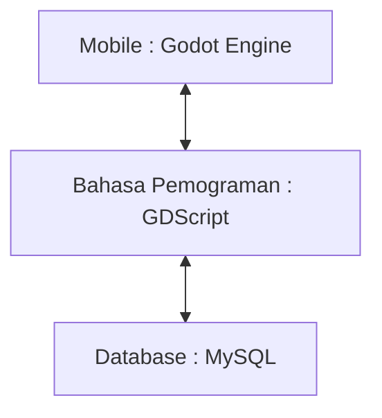
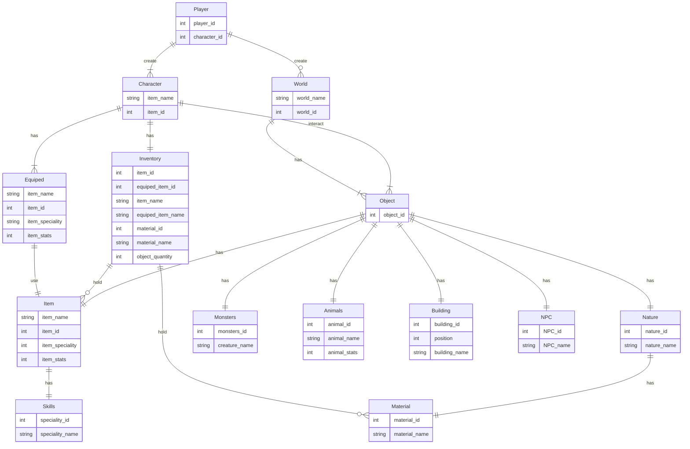

# Hello Informatics !

## Menjelaskan dan Menginternalisasi Computational Thinking ⭐⭐⭐⭐⭐⭐⭐
Computational Thinking (Pemikiran Komputasional) yaitu berpikir tentang pemecahan masalah yang terinspirasi oleh cara komputer memproses informasi. Menginternalisasi Computational Thinking berarti mengadopsi dan menyatukan konsep-konsep dasar yang mendasari pemikiran komputasional ke dalam pola pikir dan pendekatan kita terhadap pemecahan masalah sehari-hari. Ada beberapa aspek kunci dari Computational Thinking:

1.Pemecahan Masalah
Kemampuan untuk merinci masalah secara jelas dan memahami permasalahan secara mendalam sebelum mencari solusi.
Kemampuan untuk merepresentasikan masalah dalam bentuk yang dapat diolah oleh komputer, seperti algoritma atau model matematis.

2.Abstraksi
Mengabstraksi informasi: Kemampuan untuk menyederhanakan kompleksitas dengan mengidentifikasi pola, merinci informasi yang relevan, dan mengabaikan detail yang tidak penting.
Generalisasi: Kemampuan untuk menerapkan konsep abstrak pada berbagai situasi.

3.Algoritma dan Desain
Pengembangan algoritma: Kemampuan untuk merancang langkah-langkah sistematis untuk memecahkan masalah atau mengeksekusi tugas tertentu.
Optimisasi: Kemampuan untuk meningkatkan efisiensi algoritma dan solusi.

4.Pemahaman Data
Pengorganisasian data: Kemampuan untuk mengelompokkan, menyusun, dan mengelola data sehingga dapat diolah secara efektif.
Analisis data: Kemampuan untuk menarik kesimpulan dan membuat keputusan berdasarkan pemahaman data.

5.Pikiran Kritis
Analisis logis: Kemampuan untuk mengevaluasi logika dan kesalahan dalam pemikiran atau solusi.
Pertimbangan konsekuensi: Kemampuan untuk memikirkan implikasi dari suatu tindakan atau solusi.

6.Kolaborasi dan Komunikasi
Kemampuan berkolaborasi: Pemahaman tentang bagaimana berkolaborasi dengan orang lain untuk mencapai tujuan bersama, termasuk pembagian tugas dan komunikasi efektif.
Kemampuan menyampaikan ide: Kemampuan untuk mengomunikasikan gagasan dan solusi secara jelas dan efektif kepada orang lain.

Menginternalisasi Computational Thinking melibatkan integrasi konsep-konsep ini ke dalam cara berpikir dan bekerja sehari-hari. Ini dapat diterapkan dalam berbagai konteks, tidak hanya dalam pemrograman atau pengembangan perangkat lunak, tetapi juga dalam kehidupan sehari-hari, pendidikan, dan berbagai bidang profesional. Seseorang yang menginternalisasi Computational Thinking akan cenderung lebih terampil dalam memecahkan masalah, berpikir kritis, dan menghadapi tantangan dengan pendekatan yang sistematis.

## Menjelaskan Jenis-Jenis Mesin Komputasi ⭐⭐⭐
Mesin komputasi adalah perangkat yang dirancang untuk melakukan operasi pengolahan data dan informasi. Jenis-jenis mesin komputasi dapat dibagi berdasarkan beberapa kriteria, termasuk ukuran, tujuan, dan arsitektur. Ada beberapa jenis mesin komputasi yang umum:

Mainframe:
Mainframe adalah mesin komputasi besar yang dirancang untuk menangani volume transaksi yang tinggi dan memproses data bisnis. Digunakan dalam bisnis dan industri untuk pemrosesan transaksi keuangan, manajemen data pelanggan, dan aplikasi bisnis skala besar.

Komputer Pribadi (Personal Computer/PC):
Mesin komputasi yang dirancang untuk digunakan oleh satu orang. Digunakan untuk keperluan pribadi, pekerjaan kantor, dan hiburan.

Komputer Tablet:
Perangkat portabel dengan layar sentuh yang dapat digunakan untuk berbagai keperluan.Digunakan untuk Navigasi internet, hiburan, dan aplikasi produktivitas ringan.

## Mengktifkan dan Mencoba Google Colab [v] ⭐⭐⭐⭐⭐


## Mencoba Console Sistem Operasi
Console pada sistem operasi adalah antarmuka teks atau baris perintah yang memungkinkan pengguna berinteraksi dengan sistem operasi melalui perintah-perintah teks. Console di Windows disebut sebagai "Command Prompt", "Terminal" di sistem berbasis Unix/Linux, dan "Command Line Interface (CLI)" secara umum.

Cara mengakses dan menggunakan console dapat bervariasi tergantung pada sistem operasi yang digunakan. Ini adalah beberapa contoh cara mengakses console pada beberapa sistem operasi umum:

1. Windows:
Command Prompt:

Tekan Win + R untuk membuka jendela "Run".
Ketik "cmd" atau "cmd.exe" dan tekan Enter.
PowerShell:

Sama seperti di atas, namun ketik "powershell" dan tekan Enter.
2. Unix/Linux:
Terminal:
Buka menu aplikasi dan cari "Terminal" atau "Konsole", atau gunakan pintasan keyboard seperti Ctrl + Alt + T.

Cara Menggunakan Console:
Setelah mengakses console,kita dapat memasukkan perintah-perintah teks untuk berinteraksi dengan sistem operasi. Ada beberapa contoh perintah umum:

- dir (Windows) atau ls (Unix/Linux): Menampilkan daftar file dan direktori.
- cd (Change Directory): Berpindah ke direktori lain. Contoh: cd Documents.
- copy (Windows) atau cp (Unix/Linux): Menyalin file.
- del (Windows) atau rm (Unix/Linux): Menghapus file. Contoh: del file.txt atau rm file.txt.
### Windows CMD [v] ⭐⭐⭐⭐

Referensi [1](https://www.stationx.net/windows-command-line-cheat-sheet/)

CMD atau Command Prompt di WINDOWS. CMD dapat digunakan sesuai dengan keinginan user melalui kode-kode dibawah ini atau Command Line:
1. **`dir`:** Menampilkan daftar file dan folder dalam direktori saat ini.

2. **`cd`:** Mengubah direktori atau pindah ke direktori tertentu.

3. **`copy`:** Menyalin file dari satu lokasi ke lokasi lain.

4. **`del` atau `erase`:** Menghapus satu atau beberapa file.

5. **`mkdir` atau `md`:** Membuat direktori baru.

6. **`rmdir` atau `rd`:** Menghapus direktori (harus kosong).

7. **`echo`:** Menampilkan teks atau mengaktifkan atau menonaktifkan fitur echo.

8. **`type`:** Menampilkan isi file teks.

9. **`rename` atau `ren`:** Mengganti nama file atau direktori.

10. **`cls`:**
    - Membersihkan layar konsol.

11. **`ipconfig`:** Menampilkan informasi konfigurasi IP, seperti alamat IP dan gateway.

12. **`ping`:** Mengirim paket data ke alamat IP atau nama domain untuk menguji koneksi jaringan.
- Ini adalah beberapa contoh dari fungsi Command


- md (membuat direktori baru dalam sistem)
- cd (merubah direktori/berpindah direktori)
- color (merubah warna teks)
- date (memperlihatkan dan merubah tanggal)
- time (memperlihatkan waktu dan merubah waktu)
- hostname (memperlihatkan nama komputer)
- dir (memperlihatkan direktori yang ada didalam file
- ping (mengecek internet)
- systeminfo (memperlihatkan detail informasi dari sistem)

### Linux Terminal Menggunakan Google Colab [v] ⭐⭐⭐⭐
Linux Terminal dikenal sebagai Command Line Interface (CLI) atau shell, adalah interface berbasis teks yang memungkinkan user berinteraksi dengan sistem operasi Linux melalui baris perintah. Terminal Linux memungkinkan pengguna untuk menjalankan perintah teks dan mengakses berbagai fitur pekerjaan sistem serta menjalankan skrip dan program. (bersumber dari artikel dan ChatGPT)

karakteristik dan konsep terkait dengan Terminal Linux:
1. Shell:
   - Terminal Linux menjalankan sebuah shell, yang bertanggung jawab untuk menafsirkan dan menjalankan perintah yang dimasukkan oleh pengguna. Beberapa shell umum di Linux antara lain Bash (Bourne Again SHell), Zsh (Z Shell), dan Fish.

2. Baris Perintah:
   - Pengguna memasukkan perintah teks ke dalam terminal, dan sistem merespons dengan hasil eksekusi perintah tersebut. Baris perintah sering kali dimulai dengan prompt yang menunjukkan lokasi direktori saat ini, nama pengguna, dan sejenisnya.

3. Direktori Kerja (Working Directory):
   - Terminal selalu bekerja dalam suatu direktori tertentu pada suatu waktu. Pengguna dapat berpindah antar direktori menggunakan perintah `cd`.

4. Perintah dan Argumen:
   - Perintah diikuti oleh argumen dan opsi yang menentukan tindakan yang harus diambil oleh perintah tersebut. Misalnya, `ls` untuk menampilkan daftar file di direktori, dan `ls -l` untuk menampilkan daftar file dengan informasi lebih detail.

5. Redirection dan Pipelines:
   - Pengguna dapat mengarahkan output dari suatu perintah ke file atau perintah lain menggunakan operator seperti `>` atau `|` (pipa).

6. Perintah Berbasis Teks:
   - Terminal memungkinkan pengguna untuk melakukan berbagai tugas, seperti mengelola file, mengonfigurasi sistem, menjalankan skrip, dan banyak lagi. Sebagian besar perintah Linux bersifat teks dan dapat dipanggil melalui terminal.

7. Perintah Awal dan Aliases:
   - Pengguna dapat membuat perintah awal (shell script) dan mengonfigurasi alias untuk membuat perintah yang lebih kompleks atau mempersingkat perintah tertentu.

Terminal Linux adalah alat yang kuat dan fleksibel yang sering digunakan oleh pengguna tingkat lanjut dan administrator sistem untuk menjalankan tugas-tugas yang tidak dapat dilakukan dengan antarmuka grafis. Ini juga merupakan cara yang efisien untuk mengelola dan menjelajahi sistem operasi Linux.
Karena fleksibilitasnya, linux juga sering digunakan sebagai OS yang dapat menjelajahi lebih dalam seluk beluk dari suatu program, dan kemampuan mengulik yang lebih fleksibel dikarenakan sistem open-source nya.

contoh penggunaan Linux terminal di Google Colab
- Perlu diingat dalam menggunakan command linux di Google Colab harus disertakan dengan tanda seru (!) diawal command yang kita tuliskan, sehingga perintah dapat dieksekusi.


## Membuat Algoritma Dalam Bentuk Flow Chart [v] ⭐⭐⭐⭐⭐


- Ini adalah hasil dari bentuk flowchart di atas


 
 - Ini adalah pengunaan flowchart pada tugas UTS yaitu struktur data


  
Referensi [1](https://dev.to/angelotheman/flowchart-wizardry-master-the-art-of-visualizing-algorithms-4e4j)

## Mencoba Scratch Bahasa Indonesia [v] ⭐⭐⭐⭐⭐⭐⭐
Scratch adalah cara mudah dan menyenangkan untuk mempelajari dasar-dasar pemrograman. Ini adalah pemrograman untuk proyek, seperti permainan sederhana atau animasi, tanpa harus mengetikkan banyak kode.

Bagaimana Scratch Bekerja? menggunakan Scratch dengan menggeser dan menjatuhkan blok-blok pemrograman bersama untuk membuat perintah-perintah. Blok-blok ini merepresentasikan aksi atau peristiwa, seperti bergeraknya karakter atau suara yang dimainkan. Ini hanya perlu mengatur blok-blok ini sesuai dengan apa yang ingin Kita lakukan.

Visual dan Warna: Blok-blok di Scratch memiliki warna-warni, membuatnya lebih menyenangkan dan mudah dipahami.

Animasi dan Suara: dapat menambahkan animasi dan suara ke proyek Kita, membuatnya hidup dan interaktif.

Tidak Perlu Menulis Kode: Kita tidak perlu mengetikkan kode seperti dalam pemrograman pada biasanya. Cukup "menyusun" blok-blok.

Scratch sangat cocok untuk pemula, termasuk anak-anak dan pemula dalam pemrograman. Ini memberikan pengantar yang bagus kepada konsep-konsep dasar pemrograman tanpa membuatnya terlalu rumit.

Jadi, Scratch adalah alat yang menyenangkan dan ramah pengguna untuk belajar pemrograman tanpa harus menjadi ahli dalam mengetikkan kode.
Referensi [1](https://scratch.mit.edu/)


## Mencoba Algoritma Bubble Sort Menggunakan Java [v] ⭐⭐⭐
Bubble sort adalah algoritma pengurutan sederhana yang bekerja dengan membandingkan dan menukar elemen-elemen berpasangan secara berurutan dalam sebuah array. Ini adalah contoh implementasi bubble sort dalam bahasa Java:
public class BubbleSort {
    public static void main(String[] args) {
        int[] arr = {64, 34, 25, 12, 22, 11, 90};

        System.out.println("Array sebelum diurutkan:");
        printArray(arr);

        // Melakukan bubble sort
        bubbleSort(arr);

        System.out.println("\nArray setelah diurutkan:");
        printArray(arr);
    }

    static void bubbleSort(int[] arr) {
        int n = arr.length;
        for (int i = 0; i < n-1; i++) {
            for (int j = 0; j < n-i-1; j++) {
                // Membandingkan elemen berpasangan dan menukar jika diperlukan
                if (arr[j] > arr[j+1]) {
                    // Menukar elemen
                    int temp = arr[j];
                    arr[j] = arr[j+1];
                    arr[j+1] = temp;
                }
            }
        }
    }

    static void printArray(int[] arr) {
        for (int value : arr) {
            System.out.print(value + " ");
        }
    }
}

- bubbleSort(int[] arr): Metode ini melakukan bubble sort pada array yang diberikan.
- Dua loop bersarang digunakan untuk membandingkan dan menukar elemen-elemen secara berpasangan.
- printArray(int[] arr): Metode ini digunakan untuk mencetak elemen-elemen array.

- Ini adalah hasil dari Output Source Code di atas


## Mencoba dan Mendemonstrasikan Penggunakan IDE ⭐⭐
IDE adalah sebuah perangkat lunak yang menyediakan berbagai alat dan fitur untuk membantu pengembang perangkat lunak dalam proses pembuatan, pengujian, dan debugging program komputer.  IDE yang selama ini telah saya coba dan demonstrasikan yaitu:
 - Visual Studio dari Microsoft
 - Android Studio (dalam pengembangan aplikasi mobile)
 - Visual Studio Code sebagai text editor

- Pemanfaatan IDE dalam Android Studio untuk membuat emulator mobile android, disini saya hanya baru mencoba sampai sini karena saat mencoba untuk di run, terdapat kendala yaitu sangat lamanya saat proses running karena laptop kurang memadai. 


## Mendaftar, Mengeksplorasi, dan Mendemonstrasikan Penggunaan HackerRank [v] ⭐⭐⭐⭐⭐
Akun HackerRank saya:
https://www.hackerrank.com/profile/muhammadnurdaff1

HackerRank adalah platform pembelajaran daring yang menyediakan berbagai tantangan pemrograman dan kursus untuk memperdalam keterampilan pemrograman. Tujuan utamanya adalah membantu orang mengembangkan keterampilan pemrograman 

Demonstrasi penggunaan HackerRank:
- Mendaftar : Buka situs web HackerRank di https://www.hackerrank.com/.
  Setelah mendaftar memasukkan akun Hackerrank.
- Mencoba konten Konten: Jelajahi tantangan pemrograman, kursus, dan sertifikasi yang tersedia di Hackerrank.
- Pilih Tantangan: Pilih tantangan pemrograman yang sesuai dengan tingkat kemampuan kita.
- Kerjakan Tantangan: Kerjakan tantangan tersebut dengan menulis solusi kode. HackerRank akan mengevaluasi solusi untuk bisa memecahkan tantangan tersebut.

- Mencoba menyelesaikan soal tantangan preparation java

- Tantangan soal selanjutnya, jadi semakin kita dapat banyak menyelesaikan soal di Hackerrank maka tingkat tantangannya pun akan semakin bertambah 


## Mendemonstrasikan Pembuatan Aplikasi / Game Pada Platform : Mobile / Desktop / Web Browser ⭐⭐⭐⭐⭐
Saya di sini membuat Game dengan menggunakan game Engine Godot, Godot ini merupakana Open Source yang dapat digunakan untuk membuat permainan baik 2D maupun 3D. Godot mendukung beberapa bahasa pemrograman, termasuk GDScript (bahasa pemrograman khusus untuk Godot)
- Ini adalah penjelasan lebih lengkapnya lagi sudah saya buatkan video Demonstrasi tentang game yang saya buat di Youtube, dan ini adalah link nya https://youtu.be/ZsVw8EXnSrg?si=DxxWdzxHqPuDDUI8 dan link github UTS saya tentang game ini juga https://github.com/Daapputra/ProjekUTS/blob/main/Kibo%20The%20Explorer.md
  
- Ini adalah hasil tampilan dari game yang saya buat.


- Ini adalah kodingan dari pembuatan player nya sehingga player dapat bergerak dengan menggunkan animasi bergerak.


- Ini adalah kodingan dari apel yang ada di pohon, jadi apabila apel itu di ambil maka apel yamg ada di pohon tersebut akan menghilang karena sudah terambil.


- Ini adalah kodingan dari pembuatan jatuhnya apel tersebut dari pohon ketika di ambil


- Ini adalah penjelasan lebih lengkapnya lagi sudah saya buatkan video Demonstrasi tentang game yang saya buat di Youtube, dan ini adalah link nya https://youtu.be/ZsVw8EXnSrg?si=DxxWdzxHqPuDDUI8


## Mencoba Instalasi Database (PostgreSQL / MySQL / dsb.) [v] ⭐⭐⭐
Disini saya mendownload MySQL, Kenapa saya memilih MySQL? karena MySQL seringkali menjadi pilihan karena beberapa alasan. Pertama, MySQL adalah database open-source yang dapat diakses dan digunakan secara gratis, membuatnya ekonomis untuk banyak proyek. Selain itu, MySQL memiliki kinerja yang baik dan dapat menangani beban kerja tinggi dengan cepat dan efisien.

MySQL juga mendukung banyak fitur penting seperti indeks, transaksi, dan keamanan yang dapat diandalkan. Keberlanjutan dan dukungan komunitas yang besar juga merupakan keuntungan, karena banyak pengembang yang berkontribusi pada pengembangan dan pemeliharaan MySQL.
- Proses Download MySQL


- Konfigurasi server MySQL


  
Referensi installer [PostgreSQL](https://www.postgresql.org/download/windows/)
Referensi tambahan [1](https://db-engines.com/en/ranking)

## Mencoba Eksplorasi dan Query Database Menggunakan Database Explorer (Dbeaver / dsb.) [v] ⭐⭐⭐
Eksplorasi dan query database adalah proses mengakses, menganalisis, dan memanipulasi data yang tersimpan dalam suatu basis data. Ada beberapa cara untuk melakukan eksplorasi dan query database, tergantung pada jenis database yang digunakan dan alat yang tersedia. Berikut adalah panduan umum untuk melakukan eksplorasi dan query database.
Disni saya mencoba Eksplorasi Dbeaver di github https://github.com/dbeaver/dbeaver

-Eksplorasi Dbeaver


- Code yang digunakan kebanyakan adalah Java dan membutuhkan JDK 17 untuk dijalankan


## Eksplorasi Database:

1. Memahami Struktur Database:
   - Ketahui skema dan struktur tabel dalam database. Identifikasi kolom-kolom, tipe data, dan hubungan antar tabel.

2. Menggunakan Alat Manajemen Database:
   - Gunakan alat manajemen database seperti MySQL Workbench, pgAdmin (untuk PostgreSQL), atau SQL Server Management Studio (SSMS) untuk secara visual menavigasi dan menjelajahi database.

3. Menampilkan Sampel Data:
   - Jalankan perintah SQL SELECT untuk menampilkan sampel data dari tabel tertentu.
     ```sql
     SELECT * FROM nama_tabel LIMIT 10;
     ```

### Query Database:

1. Menulis Query Dasar:
   - Gunakan perintah SQL SELECT untuk mengambil data dari tabel.
     ```sql
     SELECT kolom1, kolom2 FROM nama_tabel WHERE kondisi;
     ```

2. Filtering Data:
   - Gunakan klausa WHERE untuk menyaring data berdasarkan kondisi tertentu.
     ```sql
     SELECT * FROM nama_tabel WHERE kolom = 'nilai';
     ```

3. Sorting Data:
   - Gunakan klausa ORDER BY untuk mengurutkan data berdasarkan kolom tertentu.
     ```sql
     SELECT * FROM nama_tabel ORDER BY kolom ASC/DESC;
     ```

4. Aggregasi Data:
   - Gunakan fungsi agregasi seperti COUNT, SUM, AVG, MIN, MAX untuk merangkum data.
     ```sql
     SELECT COUNT(id) AS jumlah_data FROM nama_tabel;
     ```
     
5. Gabungan Tabel (JOIN):
   - Gabungkan dua atau lebih tabel menggunakan klausa JOIN.
     ```sql
     SELECT * FROM tabel1
     INNER JOIN tabel2 ON tabel1.kolom = tabel2.kolom;
     ```

6. Grup dan Agregasi (GROUP BY):
   - Gunakan klausa GROUP BY untuk mengelompokkan data berdasarkan kolom tertentu.
     ```sql
     SELECT kolom, COUNT(*) AS jumlah FROM nama_tabel GROUP BY kolom;
     ```

7. Subqueries:
   - Gunakan subqueries untuk membuat query bersarang yang menghasilkan set data yang digunakan dalam query utama.
     ```sql
     SELECT kolom FROM nama_tabel WHERE kolom IN (SELECT kolom FROM tabel_lain);
     ```

8. Paging (LIMIT dan OFFSET):
   - Gunakan klausa LIMIT dan OFFSET untuk mengatur paging dalam hasil query.
     ```sql
     SELECT * FROM nama_tabel LIMIT 10 OFFSET 20;
     ```

9. Menyimpan Query:
   - Simpan query yang sering digunakan atau kompleks untuk referensi di masa depan.

10. Optimasi Query:
    - Pastikan untuk mengoptimalkan query menggunakan indeks, membatasi SELECT * jika tidak diperlukan, dan menggunakan indeks yang sesuai.

Contoh Query:
```sql
SELECT nama, usia FROM karyawan WHERE departemen = 'IT' ORDER BY usia DESC LIMIT 5;
```

Referensi installer [Dbeaver](https://dbeaver.io/download/)
Referensi [1](https://www.w3schools.com/postgresql/postgresql_create_table.php)

## Mendemonstrasikan dan Menjelaskan Penggunaan Web Browser untuk Mengakses Halaman Website HTML [v] ⭐⭐⭐⭐
- Dokumen HyperText Markup Language (HTML) ada untuk memudahkan pertukaran informasi berbasis Hypertext.
- Web Browser seperti Firefox, Chrome, Opera, ada untuk membuka dan mempresentasikan dokumen HTML
- Dokumen HTML ini bisa bersumber dari web server yang kita ingin datanya (Tokopedia, Wikipedia, Detik.com, dsb.) atau bisa juga dukumen HTML yang kita buat sendiri

- HTML (Hypertext Markup Language) dirancang khusus untuk ditampilkan di web browser. Ada beberapa alasan mengapa HTML harus ditampilkan di browser: (diambil dari artikel)

1. Interaktivitas:
   HTML menyediakan elemen dan tag yang memungkinkan pembuatan halaman web interaktif. Browser memahami struktur HTML dan mampu menampilkan elemen-elemen ini dengan cara yang memungkinkan pengguna berinteraksi dengan konten.

2. Rendering dan Tampilan:
   Browser memiliki mesin rendering yang dapat menafsirkan dan menampilkan HTML dengan cara yang sesuai dengan standar web. Mereka mengonversi markup HTML menjadi tata letak visual yang dapat dilihat oleh pengguna.

3. Kemampuan Menangani Multimedia:
   HTML tidak hanya menyediakan teks dan gambar, tetapi juga mendukung multimedia seperti audio dan video. Browser memiliki kemampuan bawaan untuk memainkan dan menampilkan elemen-elemen multimedia ini.

4. Koneksi ke Server:
   HTML bekerja secara terintegrasi dengan protokol HTTP dan HTTPS untuk mengambil informasi dari server. Browser bertindak sebagai klien yang meminta dan menampilkan halaman web dari server.

5. Pemrosesan Skrip:
   HTML dapat menyertakan skrip JavaScript yang dieksekusi oleh browser untuk menambahkan fungsionalitas dinamis ke halaman web. Browser memiliki mesin JavaScript yang memproses dan menjalankan skrip ini.

6. Kemampuan untuk Menavigasi:
   HTML menyediakan elemen-elemen seperti tautan (`<a>`) yang memungkinkan navigasi antarhalaman. Browser memungkinkan pengguna untuk mengklik tautan dan beralih antarhalaman dengan mudah.

Jadi, HTML dan browser bekerja sama untuk memberikan pengalaman pengguna yang kaya dan interaktif di dunia web. HTML sendiri adalah bahasa markup statis, dan browser menyediakan lingkungan yang dapat menafsirkan, memproses, dan menampilkan halaman web sesuai dengan spesifikasi HTML.

- Domonstrasi

- Jadi misalnya ini adalah halaman yang akan di lihat oleh pengguna(Interface)


- Lalu ini adalah cara pembuatannya

## Mendemonstrasikan dan Menjelaskan Komponen Dari Contoh Uniform Resource Locator (URL) [v] ⭐⭐
URL (Uniform Resource Locator) adalah alamat yang digunakan untuk mengidentifikasi sumber daya di internet. URL terdiri dari beberapa komponen yang menjelaskan lokasi dan protokol akses ke sumber daya tersebut. Ini adalah contoh URL beserta penjelasan untuk setiap komponennya:

Contoh URL: https://www.example.com/page?q=query

- Protokol (Protocol):
Contoh: https
Untuk menunjukkan protokol komunikasi yang digunakan, dalam hal ini, HTTPS (Hypertext Transfer Protocol Secure).

- Nama Host (Host Name):
Contoh: www.example.com
Untuk menunjukkan alamat host atau server tempat sumber daya tersebut berada.

- Path (Path):
Contoh: /page
Untuk menunjukkan jalur atau lokasi spesifik dari sumber daya di dalam server.

- Query String:
Contoh: q=query
Untuk menunjukkan parameter atau informasi tambahan yang dikirimkan ke server. Query string dimulai dengan tanda tanya (?).

Jadi, keseluruhan URL ini menggambarkan protokol HTTPS, sumber daya yang terletak di server dengan nama host "www.example.com" dan di jalur "/page", dengan parameter query "q" memiliki nilai "query".


Referensi: [1](https://www.startertutorials.com/ajwt/uniform-resource-locator.html)

## Mencoba Pelacakan Informasi Server dari Alamat Domain [v] ⭐
Pelacakan informasi server dari alamat domain dapat dilakukan dengan menggunakan berbagai alat dan metode. Beberapa cara umum untuk melacak informasi server termasuk:

- NSLOOKUP (Name Server Lookup): Alat ini dapat digunakan untuk menemukan informasi DNS dari suatu domain, termasuk alamat IP servernya. Contoh perintah di terminal/command prompt:
nslookup namadomain.com
WHOIS Lookup: Layanan WHOIS memberikan informasi tentang pemilik domain, termasuk alamat IP dan server nama. Anda dapat menggunakan situs web WHOIS atau alat dari terminal/command prompt. 
Contoh:
whois namadomain.com
Traceroute (Trace Route): Alat ini membantu melacak rute paket data dari titik asal ke server tujuan, memberikan wawasan tentang titik-titik perantara. 
Contoh:
traceroute namadomain.com

- Kemudian disini saya mencoba pelacakan menggunakan Command-line Tools


  
Referensi terkait: [1](https://en.wikipedia.org/wiki/Country_code_top-level_domain) [2](https://en.wikipedia.org/wiki/List_of_Internet_top-level_domains)

## Mencoba Pembuatan Halaman Web Menggunakan HTML, CSS, dan JavaScript [v] ⭐⭐⭐
- Disini saya mencoba membuat Halaman Web menggunakan HTML, dan ini adalah kodingannya


- Kemudian disini adalah User Interface nya nanti ketika sudah bisa digunakan oleh user


Referensi tutorial 
- Isi konten halaman web : [HTML](https://www.w3schools.com/html/)
- Styling halaman web : [CSS](https://www.w3schools.com/css/)
- Interaktivitas halaman web : [JavaScript](https://www.w3schools.com/js/)

## Mencoba Penerapan Teknik Search Engine Optimization (SEO) Pada HTML [v] ⭐⭐⭐

Referensi []

## Mencoba Pembuatan File JSON [v] ⭐⭐⭐

## Mencoba Penggunaan Web Hosting Dengan Untuk Halaman HTML [v] ⭐⭐⭐


## Mencoba Penggunaan Web Hosting Dengan Untuk Web Service [v] ⭐⭐⭐

## Mencoba HTTP Request dan Web API dengan Hoppscotch / Postman [v] ⭐⭐

## Mendemonstrasikan Penggunaan Developer Tools Pada Web Browser (Firefox / Chrome) [v] ⭐⭐⭐⭐⭐

## Mengeksplorasi dan Menjelaskan Layanan Cloud Service yang Diminati (GCP / AWS / Azure) [v] ⭐⭐
Saat ini banyak perusahaan berbasis digital seperti Gojek, Tokopedia, Instagram, Telkom memanfaatkan Cloud Service karena memudahkan untuk mulai pembangunan dan analisis menggunakan infrastruktur digital yang dapat berkembang secara dinamis dengan tarif yang sangat teliti.

Referensi cloud service: [Amazon Web Service](https://aws.amazon.com/) [Microsoft Azure](https://azure.microsoft.com) [Google Cloud Platform](https://cloud.google.com) 

## Mencoba Penggunaan Content Management System (Wordpress) [v] ⭐⭐⭐

## Mendemonstrasikan Akses Konten Multimedia (Image, Audio, Video) ⭐⭐⭐

## Mencoba Edit Konten Multimedia (Image, Audio, Video) [v] ⭐⭐

## Mencoba Pembuatan Game dan Simulasi Menggunakan Logo [v] ⭐⭐

## Mencoba Pemrosesan Konten Multimedia (Image, Audio) Menggunakan Google Colab [v] ⭐⭐⭐

## Mencoba Web Tool AI Discriminative (Image Classification) [v] ⭐⭐⭐⭐

## Mencoba Web Tool AI Generative (Text to Image, Text to Text) [v] ⭐⭐⭐⭐

## Mencoba Model Machine Learning Menggunakan Google Colab, TTS, Speechrecognition, dan HuggingFace [v] ⭐⭐⭐

## Mencoba Data Visualization Dengan Tools [v] ⭐⭐

## Mencoba Data Visualization Dengan Code [v] ⭐⭐

## Mendaftar dan Mencoba Eksplorasi HuggingFace [v] ⭐⭐⭐
Hugging Face adalah platform dan komunitas yang fokus pada pemrosesan bahasa alami (NLP) dan pemelajaran mendalam (deep learning). Hugging Face menyediakan sumber daya dan alat untuk mempermudah pengembangan, pengujian, dan implementasi model NLP. 

- Mencoba mendaftar dan eksplorasi

- Terdapat berbagai macam libraries


## Mendaftar dan Mencoba Eksplorasi Kaggle [v] ⭐⭐⭐⭐
Kaggle adalah situs untuk berbagi ide, mendapatkan inspirasi, bersaing dengan data scientist lain, mempelajari informasi baru dan trik coding, serta melihat berbagai contoh aplikasi data science di dunia nyata.

- Login akun kaggle dan mencoba ada apa saja di Kaggle itu

- Daftar percobaan dan competition Kaggle

- Mencoba notebook dan menggunakan pyhton dasar


 

## Mencoba Protokol Komunikasi IoT (MQTT) [v] ⭐
MQTT, yang merupakan singkatan dari Message Queuing Telemetry Transport, adalah protokol komunikasi ringan yang dirancang khusus untuk digunakan dalam konteks Internet of Things (IoT). Protokol ini sangat efisien dalam mentransfer data antar perangkat yang terhubung ke jaringan, termasuk perangkat IoT. Perangkat IoT dapat berperan sebagai pengirim atau penerima pesan. Mereka dapat mempublikasikan pesan ke topik tertentu atau berlangganan ke topik untuk menerima pesan. Protokol ini dirancang untuk efisiensi, dan keamanan dalam komunikasi antarperangkat IoT. Jadi, secara umum, MyMQTT memfasilitasi pertukaran data yang efisien antarperangkat IoT melalui model publish-subscribe, di mana perangkat dapat mengirim dan menerima pesan pada topik-topik tertentu.

-
-
-


## Mencoba Memproses File CSV Menggunakan Google Colab [v] ⭐⭐
File CSV (Comma-Separated Values) adalah format penyimpanan data yang digunakan untuk menyimpan dan mengelola data dalam bentuk teks yang sederhana dan terstruktur. Format ini memungkinkan data untuk disimpan dalam tabel, di mana setiap baris dari tabel mewakili satu baris data, dan kolom-kolomnya dipisahkan oleh tanda koma. File CSV sering digunakan untuk pertukaran data antara aplikasi dan platform yang berbeda.

-ini adalah saat memasukkan file CSV menggunakan Google COlab


## Mencoba Memproses File Big Data ORC Menggunakan Google Colab [v] ⭐⭐

## Menjelaskan Jurnal, Conference, Artikel, Grade Jurnal [v] ⭐⭐⭐⭐⭐
Jurnal dalam Keinformatikaan:
Jurnal dalam dunia keinformatikaan adalah publikasi berkala yang berfokus pada penelitian, pengembangan, dan inovasi dalam bidang teknologi informasi dan komputer.
Fungsi dariJurnal keinformatikaan menyediakan platform untuk berbagi hasil penelitian, temuan terbaru, dan kontribusi ilmiah dalam subdisiplin seperti kecerdasan buatan, pemrosesan data, keamanan informasi, dan lain sebagainya.

Konferensi dalam Keinformatikaan:
Konferensi di bidang keinformatikaan adalah pertemuan yang dihadiri oleh para peneliti, praktisi, dan akademisi untuk mempresentasikan dan mendiskusikan temuan terbaru, ide, serta proyek-proyek yang berkaitan dengan teknologi informasi dan komputer.
Fungsi dari Konferensi keinformatikaan memberikan kesempatan bagi komunitas untuk berinteraksi, berkolaborasi, dan memperbarui pengetahuan mereka mengenai perkembangan terbaru dalam industri tersebut.

Artikel dalam Keinformatikaan:
Artikel dalam konteks keinformatikaan dapat merujuk pada publikasi tertulis, baik dalam bentuk jurnal, konferensi, atau media online lainnya, yang membahas topik atau konsep spesifik dalam ilmu komputer atau teknologi informasi.
Fungsi dari Artikel keinformatikaan berperan sebagai sarana untuk berbagi informasi, tutorial, analisis, atau pemikiran kritis mengenai perkembangan teknologi, metode pemrograman, atau isu-isu terkini dalam dunia komputer dan informasi.

Grade Jurnal dalam Keinformatikaan:
Grade jurnal atau peringkat jurnal dalam keinformatikaan mencerminkan kualitas dan reputasi suatu jurnal ilmiah dalam bidang teknologi informasi dan komputer.
Fungsi dari Grade jurnal membantu peneliti dan profesional dalam keinformatikaan untuk menentukan kredibilitas dan dampak suatu jurnal. Hal ini memengaruhi keputusan untuk memilih jurnal tertentu sebagai tempat publikasi atau sebagai referensi dalam riset.
## Eksplorasi Artikel Jurnal / Conference di Repository Terekognisi Internasional (IEEE / Arxiv / Science Direct / ACM /DBLP) [v] ⭐⭐⭐⭐
- IEEE tentang top bahasa pemograman tahun 2022


- Arxiv 3D Multi-Modal Holistik Menuju AI yang Terwujud

- Sciencedirect

- ACM

- DBLP


## Menonton Video Presentasi Tugas Akhir Informatika ⭐⭐⭐⭐⭐


## Mengeksplorasi Seluruh Profesi Terkait Informatika dan Profesi yang Diminati ⭐⭐⭐⭐
Profesi yang saya minati di bidang Informatika yaitu :
- Data Analyst
- CyberSecurity Engineer
- Game Developer
- Blockchain Developer
- UI UX Designer specialist
- Business Analyst


## Eksplorasi Tools Untuk Belajar Bahasa Inggris (Duolingo) ⭐⭐⭐
Duolingo adalah aplikasi belajar berbahasa dengan fitur yang menyenagkan dan menarik sangat cocok untuk orang yang suka belajar sambil di temani dengan tampilan yang menyenangkan, Duolingo ini mencakup banyak bahasa asing seperti Inggris,Jerman,Prancis,Jepang,dan lain sebagainya

- saat mencoba latihan bahasa Inggris


## Eksplorasi Tools Untuk Belajar Berbicara Bahasa Inggris (HelloTalk) ⭐⭐⭐ 
- Disini saya mencoba belajar Bahasa Inggris menggunakan HelloTalk dan mencoba untuk berkomunikasi dengan orang luar


## Eksplorasi Lowongan Pekerjaan IT ⭐⭐⭐
Disini saya sudah lumayan banyak mencari informasi dan eksplorasi tentang pekerjaan IT, tentunya lowongan pekerjaan IT banyak tersebar di internet dan ini adalah contoh pekerjaan-pekerjaan yang sudah saya Eksplore di internet
- Saya mencari tahu di jobstreet.co.id


## Eksplorasi Lowongan Freelancer IT (Upwork / Toptal / Freelancer.com) ⭐⭐⭐
Freelancer adalah seseorang yang bekerja secara mandiri tanpa terikat dengan satu perusahaan atau bos tertentu. Mereka menawarkan jasa atau keahlian mereka kepada berbagai klien atau perusahaan yang membutuhkan bantuan dalam proyek atau pekerjaan tertentu.freelance rata-rata banyak yang dapat dilakukan secara remote, part-time, dan dibayat per project, dan kemungkinan Freelancer ini cocok untuk mahasiswa.

- Eksplorasi Freelancer.co.id


## Eksplorasi dan Pilih Topik yang Diminati di Roadmap.sh ⭐⭐⭐
Roadmap itu ibaratnya seperti peta jalan untuk karier di dunia teknologi. Ini memberikan panduan langkah demi langkah tentang keterampilan dan pengetahuan apa yang perlu kita pelajari untuk mencapai tujuan tertentu dalam karier. Misalnya, jika kita ingin menjadi pengembang web, roadmap tersebut akan memberi tahu kita langkah-langkah apa yang harus diambil, bahasa pemrograman apa yang perlu kita kuasai, dan alat yang harus kita pahami, dan lain sebagainya.
Saya login di Roadmap.sh menggunakan akun github saya yaitu https://github.com/Daapputra
- Cyber Security Expert


- Backend Developer


- Blockchain Developer


- Game Developer


## Eksplorasi Top Github Project yang Diminati ⭐⭐ 
Ini adalah Top Github Project yang saya mintai diantaranya:
- Project EbookFoundation/FreeProraming book https://github.com/ebookfoundation
- Project Termux https://github.com/termux/termux-app
- Project tensorflow https://github.com/tensorflow/tensorflow
- Prokect freecodecamp https://github.com/freecodecamp

## Membangun Profil Linkedin dan Mengikuti Akun-Akun Inspirasif Bertema Informatika ⭐⭐⭐
Linkedin profile saya dan ini adalah link nya https://www.linkedin.com/in/muhammad-nur-daffa-6867762a6/
- Microsoft
- MySkill
- Dicoding Indonesia
- Telkomsel
- BUMN
- Adobe

## Membangun Profil Github Page ⭐⭐⭐⭐⭐
Ini adalah akun Profile Github Page saya https://github.com/Daapputra

## Mengikuti Workshop / Event / Course Terkait IT ⭐⭐⭐⭐
- Mengikuti Zoom Meeting dari Kapita Selekta Informatika bertema "Generative AI in Natural Language Processing
- Mengikuti GDSC Study Club

## Membaca dan Mengambil Inspirasi Dari Buku Bertema Informatika ⭐⭐⭐⭐⭐
Buku bertemakan Informatika yang saya ambil berjudul "The Pragmatic Programmer: Your Journey to Mastery" oleh Dave Thomas dan Andy Hunt, alasan saya memilih buku ini karena Buku ini memberikan wawasan praktis dan saran yang relevan untuk pengembang perangkat lunak, termasuk pemula dan mahasiswa. Kemudian ini adalah beberapa alasan mengapa buku ini bisa cocok untuk mahasiswa:

Orientasi pada Keterampilan Umum:

Buku ini membahas keterampilan dasar dalam pemrograman dan pengembangan perangkat lunak. Ini bisa menjadi panduan yang baik bagi mahasiswa untuk memahami dan mengasah keterampilan dasar mereka.
Pola Desain dan Prinsip Perancangan:

Memberikan pemahaman tentang pola desain dan prinsip perancangan yang penting dalam pengembangan perangkat lunak. Hal ini sangat bermanfaat bagi mahasiswa yang ingin membangun pemahaman mendalam tentang desain perangkat lunak.
Manajemen Proyek dan Produktivitas:

Buku ini membahas manajemen proyek yang efektif dan strategi produktivitas. Mahasiswa dapat mengambil wawasan ini untuk membantu mereka dalam proyek-proyek kuliah atau proyek pengembangan perangkat lunak lainnya.
Pemikiran Kritis dan Problem Solving:

Mendorong mahasiswa untuk mengembangkan pemikiran kritis dan kemampuan pemecahan masalah. Ini adalah keterampilan penting dalam dunia pengembangan perangkat lunak.
Pembelajaran Seumur Hidup:

Mengajak mahasiswa untuk memiliki sikap pembelajaran seumur hidup, yang penting dalam dunia teknologi yang terus berkembang pesat.
Ditulis dengan Gaya yang Mudah Dipahami:

Gaya penulisan buku ini cukup mudah dipahami, membuatnya cocok untuk mahasiswa yang sedang belajar dan ingin mendapatkan pandangan praktis tentang pengembangan perangkat lunak.


